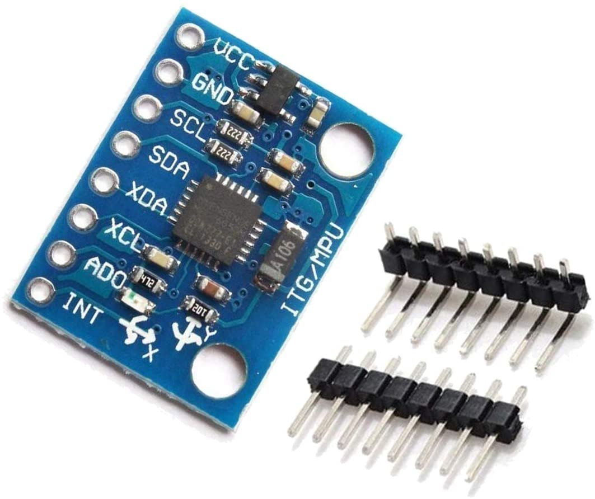

# MPU9250

**Existing Arduino libraries offer quick calibration and Roll Pitch Yaw output.**

Moving forward with this module connected to an arduino (nano tested, attiny85 to be tested).

* [A nice and simple library that works with Arduino Nano](https://github.com/hideakitai/MPU9250)
* [Arduino Library from Sparkfun](https://github.com/sparkfun/SparkFun_MPU-9250-DMP_Arduino_Library)
* [Code example of Quaternion to Euler Ange conversion](https://en.wikipedia.org/wiki/Conversion_between_quaternions_and_Euler_angles)
* [Python module for talking to the MPU9250](https://github.com/FaBoPlatform/FaBo9AXIS-MPU9250-Python/)
* [Sensor Fusion Algorithm](https://github.com/adityanarayanan03/MPU9250/blob/master/source_code/sensorFusion.py) -- [repo](https://github.com/adityanarayanan03/MPU9250)

---

# MPU6050

**NOTE: This sensor has serious drift issues and existing python libraries did not expose the digital motion processor functionality. Libraries for Arduino expose DMP functionality, but do not resolve the drift issues**

These instructions are for setting up a RaspberryPi 4 B to use the [MPU6050](https://invensense.tdk.com/wp-content/uploads/2015/02/MPU-6000-Datasheet1.pdf) 6-axis accelerometer and gyroscope. The breakout we're working with is the [HiLetgo GY-521](https://www.amazon.com/HiLetgo-MPU-6050-Accelerometer-Gyroscope-Converter/dp/B01DK83ZYQ) available on Amazon for \$5 a piece or \$9 for a pack of 3.



## Installation

### Software

1. Update installed packages: `sudo apt-get update && sudo apt-get upgrade -y`
1. Install required packages: `sudo apt-get install -y git python3-pip python3-smbus`
1. Install mpu6050 python module: `pip3 install mpu6050-raspberrypi`

* Modifications to the module code can be done by forking and installing the module from [the source](https://github.com/m-rtijn/mpu6050): `git clone --depth 1 https://https://github.com/m-rtijn/mpu6050.git`

### Enable i2c and configure for fast mode

Note: Some of these steps maybe redundant and/or apply to other Raspberry Pi models.

1. Replace `#dtparam=i2c_arm=on` with `dtparam=i2c_arm=on,i2c_arm_baudrate=4000000` and `dtparam=i2c1=on,i2c1_baudrate=4000000` on a new line in `/boot/config.txt`.
1. Add `#` to the beginning of the line `blacklisti2c-bcm2708` in `/etc/modprobe.d/raspi-blacklist.conf` if necessary.
1. A the following lines to `/etc/modules`:

```
i2c-dev
i2c-bcm2708
```

1. Reboot: `sudo reboot -h now`

### Wiring

1. Solder the supplied headerpins to the breakout board.
1. Use the table below to connect the breakout board to your Raspberry Pi:

```
note: we're using J8 pins 4&5 for a cooling fan ;)

Breakout	RPi4 J8 Pin
--------	-----------
VCC			2
GND			9
SCL			5
SDA			3
XDA			nc
XCL			nc
AD0			nc
INT			nc
```

### Making Contact

1. Run `i2cdetect -y 1`

```
     0  1  2  3  4  5  6  7  8  9  a  b  c  d  e  f
00:          -- -- -- -- -- -- -- -- -- -- -- -- -- 
10: -- -- -- -- -- -- -- -- -- -- -- -- -- -- -- -- 
20: -- -- -- -- -- -- -- -- -- -- -- -- -- -- -- -- 
30: -- -- -- -- -- -- -- -- -- -- -- -- -- -- -- -- 
40: -- -- -- -- -- -- -- -- -- -- -- -- -- -- -- -- 
50: -- -- -- -- -- -- -- -- -- -- -- -- -- -- -- -- 
60: -- -- -- -- -- -- -- -- 68 -- -- -- -- -- -- -- 
70: -- -- -- -- -- -- -- -- 
```
The output tells us the mpu6050 is on i2c bus 1, address `0x68`

1. Use the `python3` console to get some data from the mpu6050:

```
pi@raspberrypi:~ $ python3
Python 3.7.3 (default, Jul 25 2020, 13:03:44) 
[GCC 8.3.0] on linux
Type "help", "copyright", "credits" or "license" for more information.
>>> from mpu6050 import mpu6050
>>> sensor = mpu6050(0x68)
>>> sensor.get_gyro_data()
{'x': 0.3511450381679389, 'y': 4.3816793893129775, 'z': -0.8091603053435115}
```
Note: It may be possible to simply do some filtering on grabs from the FIFO to get Roll, Pitch, Yaw data. Haven't really investigated, but grabbing data off the registers may require some register programming. [Here's a reference for that](https://cdn.sparkfun.com/datasheets/Sensors/Accelerometers/RM-MPU-6000A.pdf) (spoiler... the DMP is not documented).

## Additional Code

* [MPU6050-I2C-Python-Class](https://github.com/thisisG/MPU6050-I2C-Python-Class)
* [i2cdevlib/Arduino/MPU6050/](https://github.com/jrowberg/i2cdevlib/tree/master/Arduino/MPU6050)
* [Linux Driver?!?](https://elixir.bootlin.com/linux/latest/source/drivers/iio/imu/inv_mpu6050)

## Learnding

* [A review of basic IMU sensors that work with Arduino, and how to interface Arduino with the best sensor available.](https://maker.pro/arduino/tutorial/how-to-interface-arduino-and-the-mpu-6050-sensor)
* [6 degrees of freedom MPU-6050](https://hackaday.io/project/19587-arduino-skillz/log/52443-6-degrees-of-freedom-mpu-6050)
* [Arduino and MPU6050 Accelerometer and Gyroscope Tutorial](https://howtomechatronics.com/tutorials/arduino/arduino-and-mpu6050-accelerometer-and-gyroscope-tutorial/)
* [Get Orientation with Arduino and MPU6050](https://www.teachmemicro.com/orientation-arduino-mpu6050/)
* [MPU6050 - getting absolute pitch angle](https://forum.arduino.cc/index.php?topic=629154.0)
* [Gravity Vector Maths](https://forum.arduino.cc/index.php?topic=447522.0)

## Alternative Sensors

* [Alternative Sensor MPU9250](https://www.netburner.com/learn/interfacing-the-mpu9250-imu-for-absolute-orientation-data/)

## Advanced Settings

[MPU-6000 and MPU-6050
Register Map and Descriptions
Revision 4.2](documents/MPU-6000-Register-Map1.pdf)

Note: Find interesting features, see if the mpu6050 python module exposes them.

### Set Gyro Clock Rate

* Register 25 – Sample Rate Divider: `SMPLRT_DIV`
* Register Address: `0x19`
* Sample Rate = Gyroscope Output Rate / (1 + SMPLRT_DIV)
* **SMPLRT_DIV:** 8-bit unsigned value. The Sample Rate is determined by dividing the
gyroscope output rate by this value.

Example: `0x19	XXXXXXXX` where `XXXXXXXX` sets the 8-bit value for `SMPLRT_DIV`

### Set Gyro Range
* Register 27 – Gyroscope Configuration: `GYRO_CONFIG`
* Register Address: `0x1B`

```
FS_SEL	dps
------	---
0		+/- 250
1		+/- 500
2		+/- 1000
3		+/- 2000
```

Example: `0x1B	000XX000` where `XX` is `0bFS_SEL` value

### Interrupts

* Register 55 – INT Pin / Bypass Enable Configuration: `INT_PIN_CFG`
* Register Address: `0x37`

Example: `0x37 00100000` Configures the Interrupt to PUSH/PULL HIGH/LOW and hold HIGH on `INT` until regiser `0x58` is read.

* Register 56 – Interrupt Enable: `INT_ENABLE`
* Register Address: `0x38`

Example: `0x38 00010001` Enables a FIFO buffer overflow to generate an interrupt AND enables the Data Ready interrupt, which occurs each time a write operation to all of the sensor registers has been completed.

* Register 58 – Interrupt Status: `INT_STATUS`
* Register Address: `0x3A`

Example: `0x3A 000X000Y` where `X` indicates `FIFO_OFLOW_INT` and `Y` indicates `DATA_RDY_INT`

---

# BNO055

Adafruit... I kinda am beginning to not be so into their products because of the sprawling and seemingly patchy nature of their documentation... It also appears to require I2C clock stretching to work on the RaspberryPi, not even going to try to attempt this on the JetsonNano. Send it back

* [Driver from Adafruit](https://github.com/adafruit/Adafruit_CircuitPython_BNO055/tree/a716040e9ffb08504502b5425d2692c990cef906)
